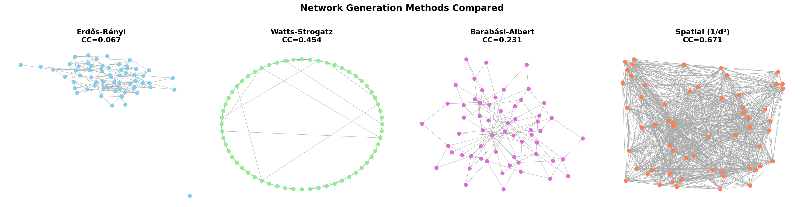
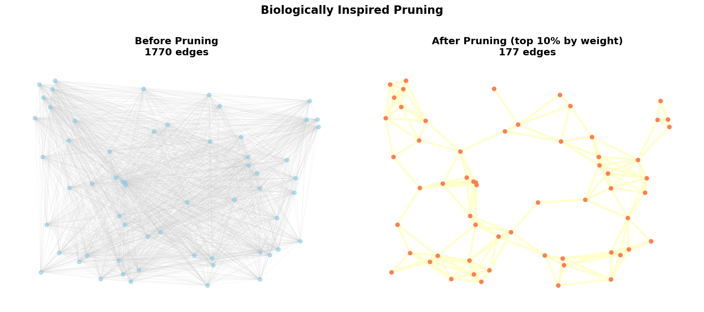
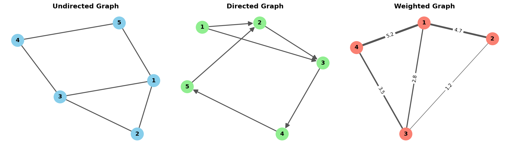
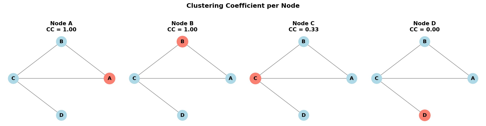

# Biologically Inspired Graph Networks

A self-teaching course exploring how biological neural network topology can inform the design of sparse network architectures for machine learning. The course builds from graph theory fundamentals to biologically grounded network generation methods, with a focus on pruning-based construction that mirrors synaptic development.

Part of a broader research programme connecting neuroscience to AI alignment. See the [project context](#project-context) section below.



## Notebooks

| # | Title | Topics |
|---|-------|--------|
| 1 | **Introduction to Graph Theory** | Graph types, biological motivation, key concepts (paths, cycles, degree), why graphs model neural circuits |
| 2 | **Analyzing Graph Features** | Clustering coefficient, path length, small-world coefficient (Humphries & Gurney 2008), Watts-Strogatz phase transition |
| 3 | **Generating Sparse Networks — Techniques** | ER, WS, BA, spatial/geometric generators; classification by construction method (iterative, online, adaptive, multi-pass) |
| 4 | **Generating Biologically Inspired Graphs** | Waxman model, hierarchical modular networks, stochastic block models, distance-dependent weighted generation |
| 5 | **Generating Graphs Using Pruning** | Deterministic, probabilistic, and distance-weighted pruning; comparison against baselines at 50/80/95% sparsity |
| 6 | **Multiple Pruning Events** | Developmental cycles (degrade → Pareto reinforce → prune), directionality, hierarchy, input-driven plasticity |
| 7 | **Functional Cluster Analysis** | Spectral clustering, Louvain community detection, weighted modularity, hierarchical clustering, cross-method comparison |

## Key Ideas

The brain doesn't build sparse networks from scratch — it starts dense and prunes. This course implements that process computationally:

1. **Spatial embedding** — nodes have positions; connection probability follows an inverse-square distance law
2. **Distance-dependent weights** — nearby connections are stronger, producing biologically realistic weight distributions
3. **Iterative developmental pruning** — weight degradation, Pareto-principle reinforcement, and probabilistic elimination across multiple cycles

The resulting networks exhibit higher clustering, clearer modular structure, and more biologically realistic weight distributions than standard random graph baselines (ER, WS, BA) at matched sparsity.



## Visualisations

<p float="left">
  
</p>

<p float="left">
  
</p>

## Running the Notebooks

The notebooks are designed for Google Colab or a local Jupyter environment. Dependencies:

```bash
pip install networkx matplotlib numpy scipy python-louvain scikit-learn
```

Notebooks are sequential — each builds on concepts and code from the previous ones.

## Research Hypotheses

The course supports two testable hypotheses:

**H1 (Generative Mechanism):** Small-world networks generated using inverse-square distance-weighted connectivity, combined with developmental pruning, produce sparse architectures with superior initialisation properties compared to ER or WS baselines at matched sparsity.

**H2 (Bandwidth/Clustering):** Optimal small-world clustering statistics depend on input/output dimensionality ratio — monitorable during pruning experiments.

## License

MIT
